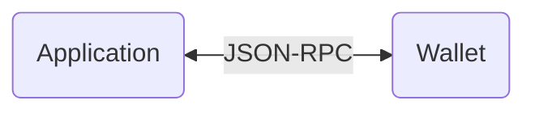

 
 <h2 align="center">Wallet API</h2>
 
Integrate your application or service inside a Ledger client wallet

  

  <!-- Update with each individual package version -->
    
    <!-- Update with each individual package version (or the monorepo version if applicable) -->
    
    <!-- Enable and display when CI set up -->
    <!--  -->
    
    
    
  

  

    <a href="https://developers.ledger.com/docs/live-app/start-here/">Ledger Developer Portal</a>
    ·
    <a href="https://github.com/LedgerHQ/platform-sdk/issues/new/choose">Report Bug</a>
    ·
    <a href="https://github.com/LedgerHQ/platform-sdk/issues/new/choose">Request Feature</a>
  

  <!-- Also add monorepo docuzaurus doc when available -->

# About

This monorepo hosts the Wallet API and some reference implementations to allow anyone to seamlessly integrate on top of Ledger ecosystem.

# Get started

To get started, head over to the [specifications](/spec/README.md) part of the documentation to get a bird's-eye view of the API and its different parts including the [RPC specification](/spec/rpc/README.md), as well as the [client](/spec/client/README.md) and [server](/spec/server/README.md) ones.

# How does it works

The Wallet API defines an interface for applications and wallets to interact within the Ledger ecosystem, allowing cross compatibilitiy between applications and wallets, in a currency agnostic way.

<!-- TODO: link to reference implementations of client and server once available -->

Each wallet and application then needs to implement this interface. In this repo, you will find a reference implementation for the client part of the interface and one for the server parth of the interface, under the `/packages` directory.

# Supported CryptoCurrency

| CryptoCurrency id (Family)        | Wallet API | Ledger Live  |
| --------------------------------- | ---------- | ------------ |
| bitcoin                           | ✅         | ✅           |
| ethereum                          | ✅         | ✅           |
| axelar (cosmos)                   | ✅         | ✅           |
| stargaze (cosmos)                 | ✅         | ✅           |
| secret_network (cosmos)           | ✅         | ✅           |
| umee (cosmos)                     | ✅         | ✅           |
| desmos (cosmos)                   | ✅         | ✅           |
| dydx (cosmos)                     | ✅         | ✅           |
| onomy (cosmos)                    | ✅         | ✅           |
| sei_network (cosmos)              | ✅         | ✅           |
| quicksilver (cosmos)              | ✅         | ✅           |
| persistence (cosmos)              | ✅         | ✅           |
| avalanche_c_chain (ethereum)      | ✅         | ✅           |
| bsc (ethereum)                    | ✅         | ✅           |
| polkadot                          | ✅         | ✅           |
| solana                            | ✅         | ✅           |
| ripple                            | ✅         | ✅           |
| litecoin (bitcoin)                | ✅         | ✅           |
| polygon (ethereum)                | ✅         | ✅           |
| bitcoin_cash (bitcoin)            | ✅         | ✅           |
| stellar                           | ✅         | ✅           |
| dogecoin (bitcoin)                | ✅         | ✅           |
| cosmos                            | ✅         | ✅           |
| crypto_org                        | ✅         | ✅           |
| crypto_org_croeseid (crypto_org)  | ✅         | ✅           |
| celo                              | ✅         | ✅           |
| dash (bitcoin)                    | ✅         | ✅           |
| tron                              | ✅         | ✅           |
| tezos                             | ✅         | ✅           |
| elrond                            | ✅         | ✅           |
| ethereum_classic (ethereum)       | ✅         | ✅           |
| zcash (bitcoin)                   | ✅         | ✅           |
| decred (bitcoin)                  | ✅         | ✅           |
| digibyte (bitcoin)                | ✅         | ✅           |
| algorand                          | ✅         | ✅           |
| qtum (bitcoin)                    | ✅         | ✅           |
| bitcoin_gold (bitcoin)            | ✅         | ✅           |
| komodo (bitcoin)                  | ✅         | ✅           |
| pivx (bitcoin)                    | ✅         | ✅           |
| zencash (bitcoin)                 | ✅         | ✅           |
| vertcoin (bitcoin)                | ✅         | ✅           |
| peercoin (bitcoin)                | ✅         | ✅           |
| viacoin (bitcoin)                 | ✅         | ✅           |
| bitcoin_testnet (bitcoin)         | ✅         | ✅           |
| ethereum_ropsten (ethereum)       | ✅         | ✅           |
| ethereum_goerli (ethereum)        | ✅         | ✅           |
| ethereum_sepolia (ethereum)       | ✅         | ✅           |
| ethereum_holesky (ethereum)       | ✅         | ✅           |
| hedera                            | ✅         | ✅           |
| cardano                           | ✅         | ✅           |
| filecoin                          | ✅         | ✅           |
| osmo (cosmos)                     | ✅         | ✅           |
| fantom (ethereum)                 | ✅         | ✅           |
| cronos (ethereum)                 | ✅         | ✅           |
| moonbeam (ethereum)               | ✅         | ✅           |
| songbird (ethereum)               | ✅         | ✅           |
| flare (ethereum)                  | ✅         | ✅           |
| near                              | ✅         | ✅           |
| optimism (ethereum)               | ✅         | ✅           |
| optimism_goerli (ethereum)        | ✅         | ✅           |
| arbitrum (ethereum)               | ✅         | ✅           |
| arbitrum_sepolia (ethereum)       | ✅         | ✅           |
| rsk (ethereum)                    | ✅         | ✅           |
| bittorrent (ethereum)             | ✅         | ✅           |
| kava_evm (ethereum)               | ✅         | ✅           |
| evmos_evm (ethereum)              | ✅         | ✅           |
| energy_web (ethereum)             | ✅         | ✅           |
| astar (ethereum)                  | ✅         | ✅           |
| metis (ethereum)                  | ✅         | ✅           |
| boba (ethereum)                   | ✅         | ✅           |
| moonriver (ethereum)              | ✅         | ✅           |
| velas_evm (ethereum)              | ✅         | ✅           |
| syscoin (ethereum)                | ✅         | ✅           |
| vechain                           | ✅         | ✅ (next)    |
| klaytn (ethereum)                 | ✅         | ✅           |
| internet_computer                 | ❌         | ✅           |
| polygon_zk_evm (ethereum)         | ✅         | ✅           |
| polygon_zk_evm_testnet (ethereum) | ✅         | ✅           |
| base (ethereum)                   | ✅         | ✅           |
| base_sepolia (ethereum)           | ✅         | ✅           |
| stacks                            | ✅         | ✅ (develop) |
| telos_evm (ethereum)              | ✅         | ✅           |
| coreum (cosmos)                   | ✅         | ✅           |
| injective (cosmos)                | ✅         | ✅           |
| casper                            | ❌         | ✅           |
| neon_evm (ethereum)               | ✅         | ✅           |
| lukso (ethereum)                  | ✅         | ✅           |
| linea (ethereum)                  | ✅         | ✅           |
| linea_goerli (ethereum)           | ✅         | ✅           |
| neo                               | ✅         | ❌           |

# Where to get help

You can get help by:

- Heading over to our [Ledger Develop Portal](https://developers.ledger.com)
- Joining our [Discord](https://developers.ledger.com/discord-pro)
- See [SUPPORT.md](/SUPPORT.md)

# Contributing

Contributions are always welcome! Please read the [contribution guidelines](/CONTRIBUTING.md) first.

# Security policy

You can find our security policy [here](/SECURITY.md).
