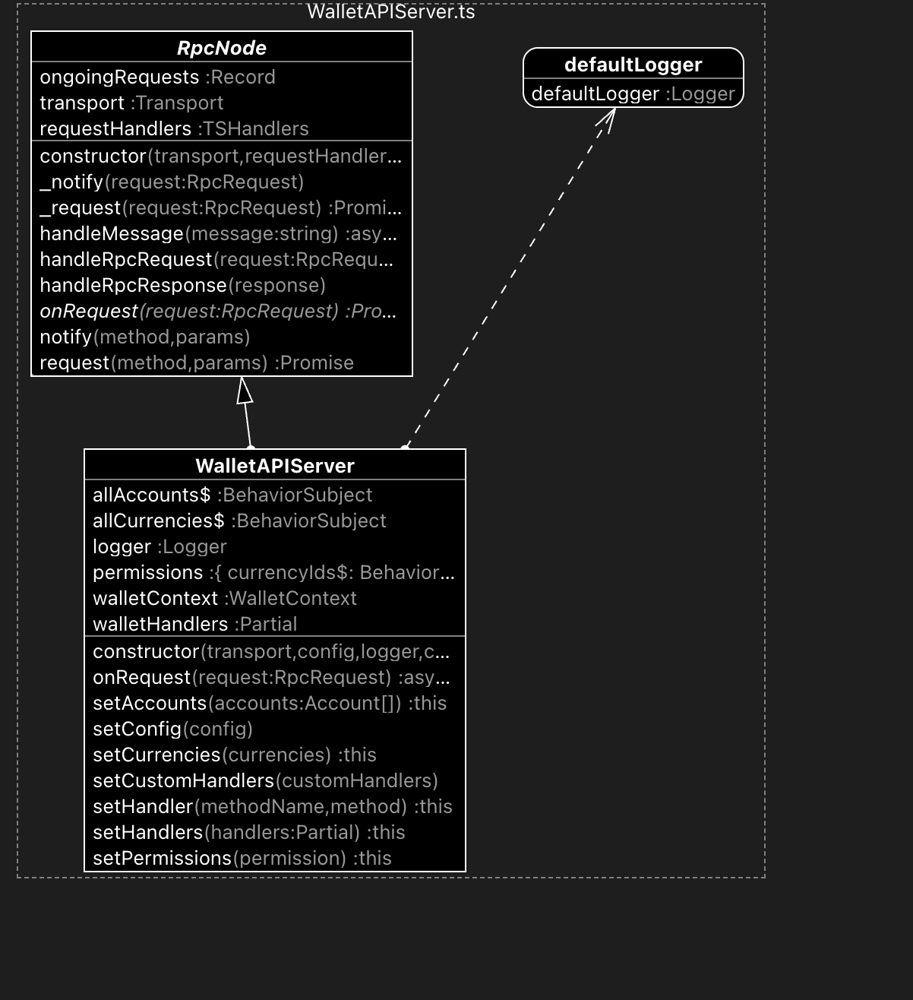

## RPCNode

**WalletAPIServer extends the abstract class RPCNode**, so let's first dig into what RPCNode is:

<details>
<summary>Class diagram overview 📝</summary>



</details>

[source code](https://github.com/LedgerHQ/wallet-api/blob/main/packages/core/src/JSONRPC/RpcNode.ts)

## properties

- transport: allows our server to communicate with the webview
  - receives message from webview with `transport.onMessage` being set to this.handleMessage
  - sends message to webview with `transport.send` on error / response.

## methods

- requests: ignore it, used only by WalletAPIClient
- handleMessage: forwards RPC message to handleRequest or handleResponse
  - if handleRequest is called, it calls `onRequest` method of the WalletAPIServer

### notify

sends a message to the app using `this.transport.send`

---

## RPC Requests

```js filename="packages/core/src/JSONRPC/types.ts"
/**
 * A rpc call is represented by sending a Request object to a Server.
 */
type RpcRequest<MParam = string, TParam = unknown> = {
  /**
   * A String specifying the version of the JSON-RPC protocol. **MUST** be exactly "2.0".
   */
  jsonrpc: "2.0";

  /**
   * A String containing the name of the method to be invoked.
   */
  method: MParam;

  /**
   * A Structured value that holds the parameter values
   * to be used during the invocation of the method.
   */
  params?: TParam;

  /**
   * An identifier established by the Client that **MUST** contain a `String`, `Number`,
   * or `NULL` value if included.
   * If it is not included it is assumed to be a notification.
   * The value **SHOULD** normally not be Null and Numbers **SHOULD NOT** contain fractional parts
   */
  id?: string | number | null;
};
```
