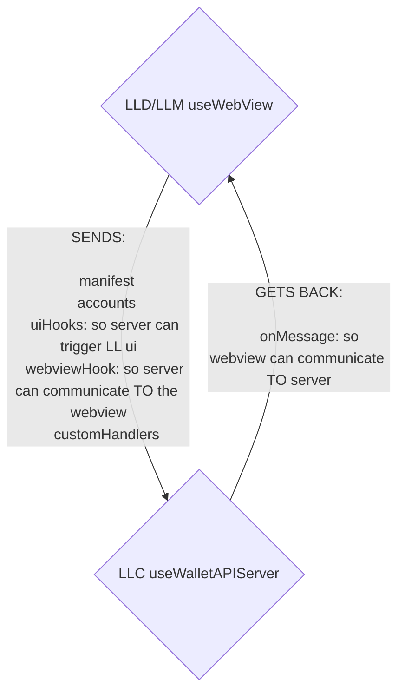
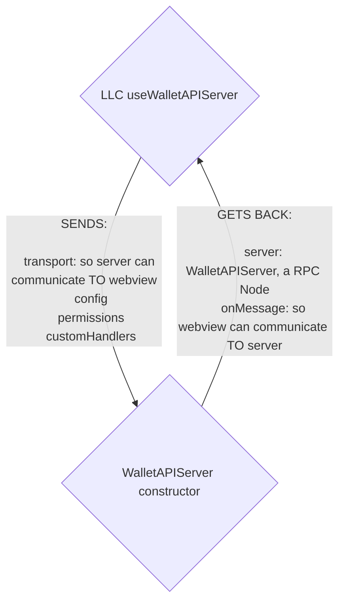

import { Callout } from "nextra/components";
import { Steps } from "nextra/components";

## Usage of the walletAPIServer in Ledger Live

[Ledger Live](https://github.com/LedgerHQ/ledger-live/) implements its own React hook `useWalletAPIServer` to create and manage a `WalletAPIServer` instance.

<Callout type="info" emoji="ℹ️">
  The `useWalletAPIServer` hook is implemented directly in Ledger Live (in
  **ledger-live-common/src/wallet-api/react.ts**), not in the wallet-api
  library. This allows Ledger Live to have full control over the server
  instantiation and configuration.
</Callout>

This Ledger Live hook is used in both
[LLD](https://github.com/LedgerHQ/ledger-live/blob/43aeb2a1c650c6231c14149b74e4a42135b15766/apps/ledger-live-desktop/src/renderer/components/Web3AppWebview/WalletAPIWebview.tsx#L10)
and [LLM](https://github.com/LedgerHQ/ledger-live/blob/43aeb2a1c650c6231c14149b74e4a42135b15766/apps/ledger-live-mobile/src/components/Web3AppWebview/helpers.ts#L8)

## useWebview()

<Steps>
### useWebView() gets called

Both LLD and LLM, when creating live apps, use the hook `useWebView`,
with the main arguments being:

- [manifest](../../appendix/manifest)
- [customHandlers](../wallet-api-server#requesthandlers)
- webviewRef

```ts filename="apps/ledger-live-desktop/src/renderer/components/Web3AppWebview/WalletAPIWebview.tsx"
const WalletAPIWebview => {
  ({ manifest customHandlers} ) => {
    const { webviewRef } = useWebviewState();

    useWebView({ manifest, customHandlers}, webviewRef);
    return <webview />
  }
};
```

### Prepares transport

Will allow communication with the webview.

```ts filename="simplified"
const webviewHook =  {
  return {
    postMessage: (message) => {
        webviewRef.current.contentWindow?.postMessage(message);
    },
  };
};
```

### Prepares uiHooks

They will allow walletHandlers to trigger ui actions

<details>
    <summary>more on uiHooks</summary>

uiHooks are created in useWebView and sent to LLC useWalletAPIServer
`uiHook` is an object that maps a method like `"account.request"` to an action in LLD / LLM
here's a list of actions it triggers in LLD:

- opening a drawer to select an account, start an exchange process
- opening modals to sign transactions, messages, start an exchange process, connect a device
- store data / update account data
- display toaster

</details>

### LLC useWalletAPIServer() gets called

Ledger Live's `useWalletAPIServer` hook instantiates a `WalletAPIServer` directly using its [constructor](../wallet-api-server#constructor).

Before doing so it:

- Extracts [permissions](../wallet-api-server#permissions) from the manifest

- Fetches and filters currencies (coming from `libs/ledger-live-common/src/currencies/helpers.ts` `listCurrencies`)

- Creates a [transport](../wallet-api-server#transport)

```js
function useTransport(postMessage: (message: string) => void | undefined): Transport {
  return useMemo(() => {
    return {
      onMessage: undefined,
      send: postMessage, // will allow WALLETAPISERVER -> LIVEAPP communication (via postMessage)
    };
  }, [postMessage]);
}

  const transport = useTransport(webviewHook.postMessage);
```

### walletAPIServer gets instantiated

The `WalletAPIServer` is instantiated using the [WalletAPIServer constructor](../wallet-api-server#constructor) with the prepared transport, config, logger, and custom handlers.

### post-instantiation transport setup

walletAPIServer sends back its `onMessage` callback, the webview will use
it to send message to it.

```ts {1,12-13, 20}
const { server, onMessage } = useWalletAPIServer({
  manifest,
  config,
  webviewHook,
  uiHook,
  customHandlers,
});

const handleMessage = useCallback(
  (event: Electron.IpcMessageEvent) => {
    if (event.channel === "webviewToParent") {
      onMessage(event.args[0]);
    }
  },
  [onMessage],
);

useEffect(() => {
  webviewRef.current.addEventListener("ipc-message", handleMessage);
}, [handleMessage, onLoad]);
```

### post-instantiation setup of wallet handlers

[server.setHandler](../wallet-api-server#wallethandlers) is called
to setup Ledger Live Wallet/UI/Store callbacks.

<details>
  <summary>Simplified example of setHandler() call</summary>

```js filename="libs/ledger-live-common/src/wallet-api/react.ts"
    server.setHandler("account.request", async ({ accountIds }) => {
      return new Promise((resolve, reject) => {
        uiAccountRequest({
          onSuccess: (account: AccountLike, parentAccount: Account | undefined) => {
            resolve(accountToWalletAPIAccount(account, parentAccount));
          },
          onCancel: () => {
            reject(new Error("Canceled by user"));
          },
        });
      });
    });
  }, [manifest, server, tracking, uiAccountRequest]);
```

those handlers are saved in the property `WalletAPIServer.walletHandlers`

To recap:

- `WalletAPIServer.walletHandlers` -> callbacks defined in LLC, trigger modals / drawers / update redux store, etc.
- `WalletAPIServer.requestHandlers` -> internalHandlers + customHandlers, can call `walletHandlers` inside of them

</details>

</Steps>




