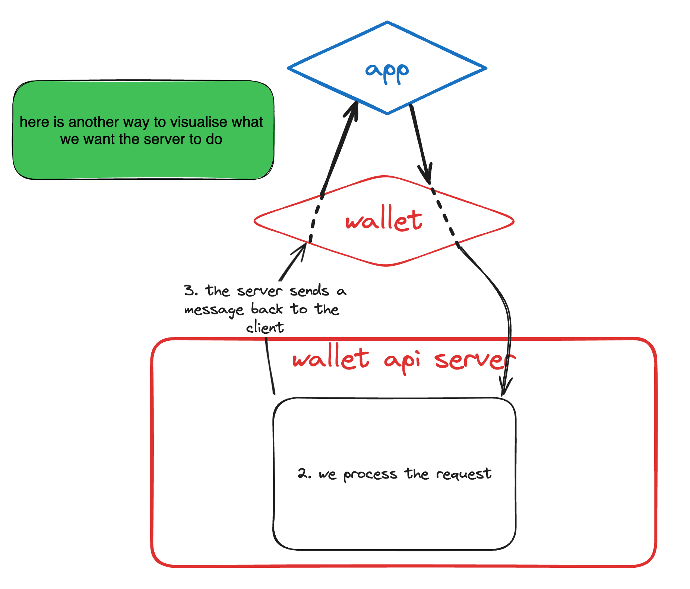

import { Callout } from "nextra/components";
import { Bleed } from "nextra-theme-docs";
import Image from "next/image";

## Slideshow

A slideshow introducing the different part of the server is available [here](https://link.excalidraw.com/p/readonly/cU4iVB5H8XFM7eW7S7u4)

## Diagrams

<Callout type="info" emoji="ℹ️">
  Those diagrams come from this introductory
  [slideshow](https://link.excalidraw.com/p/readonly/cU4iVB5H8XFM7eW7S7u4) and
  are slightly reworked to be understood as standalone diagrams.
</Callout>

### 1. a basic way to allow wallet-application interaction

<Bleed></Bleed>

### 2. process requests with requestHandlers

<Bleed></Bleed>

### 3. ask wallet for data / actions with walletHandlers

<Bleed></Bleed>

### 4. handle bidirectional communication

<Bleed></Bleed>

### 4. data passed from wallet to the server (accounts, currencies, config) and permissions

<Bleed></Bleed>
