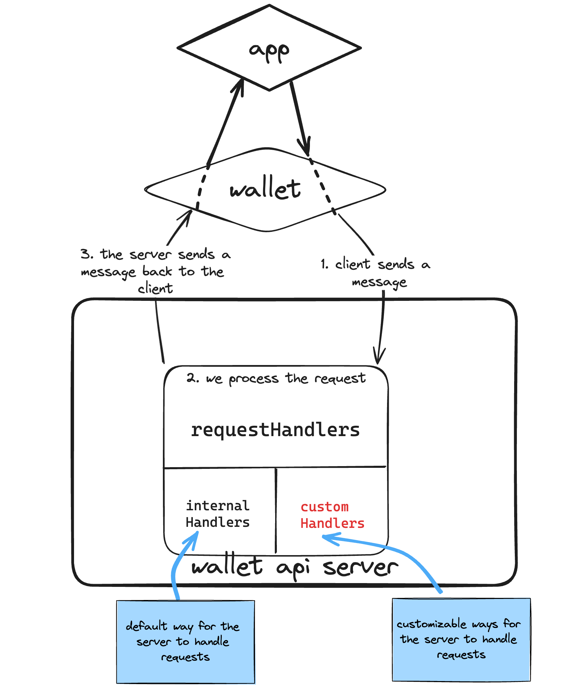
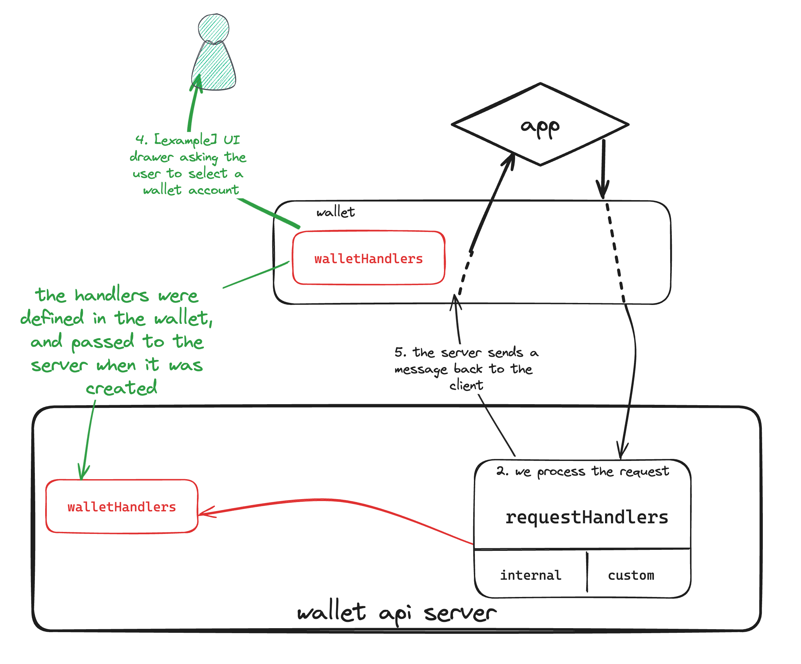

import { Callout } from "nextra/components";

## properties

### allAccounts$

Represents all available wallet accounts

`Account` is a slightly modified subject of the Account type used by the Ledger Live platform

<details>
    <summary>details of the Account type</summary>
    
```js
export type Account = {
  /**
   * The unique identifier of this account used internally by Ledger Live software
   */
  id: string;
  /**
   * The account’s name set by the user.
   */
  name: string;
  /**
   * The "next" public address where a user should receive funds. In the context of Bitcoin, the address is "renewed" each time funds are received in order to allow some privacy. In other blockchains, the address might never change
   */
  address: string;
  /**
   * The associated cryptocurrency id of the Account
   */
  currency: string;
  /**
   * The total amount of assets that this account holds
   */
  balance: BigNumber;
  /**
   * The amount of the balance that can be spent. Most of the time it will be equal to the balance, but this can vary in some blockchains
   */
  spendableBalance: BigNumber;
  /**
   * Tracks the current blockchain block height
   */
  blockHeight: number | undefined;
  /**
   * The date of the last time a synchronization was performed. In other words, tracks how up-to-date the Account data is
   */
  lastSyncDate: Date;
}; 
```

</details>

| Created via | name            |
| ----------- | --------------- |
| _setter_    | **setAccounts** |

### allCurrencies$

All available currencies that supported by the wallet.

<details>
    <summary>details of the Currency type</summary>

```js
type Currency = {
    type: "CryptoCurrency";
    name: string;
    id: string;
    color: string;
    ticker: string;
    decimals: number;
    family: "bitcoin" | "ethereum" | "algorand" | "crypto_org" | "ripple" | "cosmos" | "celo" | ... 10 more ... | "solana";
}

```

</details>

| Created via | name              |
| ----------- | ----------------- |
| _setter_    | **setCurrencies** |

---

### permissions

Permissions are a set of two lists:

1. The first restricting the [currencies](./wallet-api-server#allcurrencies) that can be used,
2. The second restricting the [requestHandlers](./wallet-api-server#requesthandlers) method that can be used,
   this list also restricts the calls that the [sendMessage](./wallet-api-server#sendmessage) method can make

| Created via | name               |
| ----------- | ------------------ |
| _setter_    | **setPermissions** |

#### permissions.currencyIds$

- a list of currencies ids an application can interact with

```js filename="example"
permissions.currencyIds$ = ["ethereum", "bitcoin"];
```

- ℹ️ it is possible to allow all currencies available in [allCurrencies](../wallet-api-server#allcurrencies) by setting this value to `["**"]`

```js filename="example with glob"
permissions.currencies$ = ["**"],
```

#### permissions.methodIds$

- a list of methods a live app can call, corresponds to a [requestHandler's name](./wallet-api-server#requesthandlers)
- this list is also checked against when _SERVER -> APP_ communication is done (in [sendMessage](./wallet-api-server#sendmessage))

```js filename="example"
permissions.methodIds$ = [
  "account.request",
  "currency.list",
  "account.list",
  "transaction.signAndBroadcast",
  "transaction.sign",
  "message.sign",
  "account.receive",
  "wallet.capabilities",
  "storage.set",
  "storage.get",
  "wallet.userId",
  "wallet.info",
  "bitcoin.getXPub",
  "exchange.start",
  "exchange.complete",
];
```

---

### walletContext

#### walletContext.currencies$

The allowed currencies:

[allCurrencies](./wallet-api-server#allcurrencies) filtered against the currencies listed in [permissions.currencyIds](./wallet-api-server#permissionscurrencyids)

| Created via  | name | note                                                                                                                                                           |
| ------------ | ---- | -------------------------------------------------------------------------------------------------------------------------------------------------------------- |
| _observable_ |      | set in constructor, updates anytime `allAccounts` or `allowedCurrencies` changes, more info on how it does this using rxjs [here](./extras/rxjs#combinelatest) |

#### walletContext.accounts$

The allowed accounts:

[allAccounts](./wallet-api-server#allaccounts) filtered against the allowedCurrencies computed above

| Created via  | name | note                                                                                                                                                                         |
| ------------ | ---- | ---------------------------------------------------------------------------------------------------------------------------------------------------------------------------- |
| _observable_ |      | set in constructor, updates anytime `allAccounts` or `walletContext.allowedCurrencies` changes, more info on how it does this using rxjs [here](./extras/rxjs#combinelatest) |

#### walletContext.config

An object of this form

```js
ServerConfig = {
  userId: string; // used in internal handler wallet.userID
  tracking: boolean;
  appId: string; // used in internal handler storage.ts, to store data in this fashion: object[app.id]
  wallet: { // used in internal handler wallet.info
    name: string;
    version: string;
  };
};
```

| Created via   | name          |
| ------------- | ------------- |
| _constructor_ | **config**    |
| _setter_      | **setConfig** |

---

### transport

A transport protocol used to communicate with an application

<details>
<summary>Show diagram</summary>


</details>

```js
type Transport = {
  // A function to handle messages coming from the application
  onMessage: MessageHandler

  // A function to send messages to the application
  send(message: string): void;
};

```

| Created via   | name          |
| ------------- | ------------- |
| _constructor_ | **transport** |

---

### requestHandlers

<details>
<summary>Show diagram</summary>



</details>

More on RpcRequest [here](./extras/rpc-node#rpc-requests).

A handler is a function of type `RPCHandler`

```js filename="packages/server/src/types.ts"
 type RPCHandler<TResult, TParam = unknown> = (
  request: RpcRequest<string, TParam>,
  context: WalletContext,
  handlers: Partial<WalletHandlers>,
) => Promisable<TResult>;

```

requestHandlers is an object of this type, mapping method ids (handlers name) to their RPCHandlers:

```js
{
 'handlerName': RPCHandler,
 'handlerName2': RPCHandler,
 'handlerName3': RPCHandler,
 ...
}
```

A default set of handlers will always be present, those are the `internalHandlers`.

<Callout type="info" emoji="ℹ️">
  You can find a comprehensive list of those internalHandlers
  [here](./handlers/account).
</Callout>

Additionally, you can pass `customHandlers` to the constructor.

To put it simply: `requestHandlers = internalHandlers + customHandlers {:js}`

| Created via   | name                  |
| ------------- | --------------------- |
| _constructor_ | **customHandlers**    |
| _setter_      | **setCustomHandlers** |

---

### walletHandlers

<details>
<summary>Show diagram</summary>



</details>

wallets using the wallet-api-server must implements this spec:
https://github.com/LedgerHQ/wallet-api/blob/main/spec/rpc/README.md

those functions will allow requestHandlers to interact with the wallet
most requestHandlers use one or more walletHandlers internally, to request / send data to the wallet
on top of that, request handlers will use permissions set above to filter out what's show / operated on (allowed accounts, allowed currencies)

| Created via | name            | note                                                    |
| ----------- | --------------- | ------------------------------------------------------- |
| _setter_    | **setHandler**  |                                                         |
| _setter_    | **setHandlers** | _sets in bulk, overriding all existing wallet handlers_ |

## methods

### handleMessage

A function to handle messages coming from the application

Used in conjonction with the transport property.

the `server.transport.onMessage` value is set to this function.

Parse json to either a [rpcRequest](./extras/rpc-node#rpc-requests) or rpcResponse object

Will then call `handleRpcRequest`

### handleRpcRequest

calls .onrequest, then creates an `RpcResponse` with the result and sends that
response back to the application (using `this.transport.send`)

### onRequest

call the appropriate [requestHandler](./wallet-api-server#requesthandlers) for that request

1. check if method exists by looking up [requestHandlers](./wallet-api-server#requesthandlers)
2. check if [permissions](./wallet-api-server#permissionsmethodids) allows for it to be called
3. calls it, with the following parameters :

- request ([RpcRequest](./extras/rpc-node#rpc-requests))
- [walletContext](./wallet-api-server#walletcontext)
- [walletHandlers](./wallet-api-server#wallethandlers)

### sendMessage

1. checks if it can send a message to the server by checking permissions.
2. then calls [notify](./wallet-api-server#notify)

## constructor

```js filename="packages/server/src/WalletAPIServer.ts"
class WalletAPIServer{
  constructor(
    transport: Transport,
    config: ServerConfig,
    logger = defaultLogger,
    customHandlers: CustomHandlers = {},
  ) {...}
}

```

| Parameter        | required? | note                                                                           |
| ---------------- | --------- | ------------------------------------------------------------------------------ |
| _transport_      | ✅        | sets the [transport](./wallet-api-server#transport)                            |
| _config_         | ✅        | sets the [walletContext.config](./wallet-api-server#walletcontextconfig) value |
| _logger_         | ❌        | (optional) sets the logger                                                     |
| _customHandlers_ | ❌        | (optional) sets [customHandlers](./wallet-api-server#walletcontextconfig)      |

<Callout type="info" emoji="ℹ️">
  It is how a WalletAPIServer is created in the example
  [here](./usage-examples/with-constructor)
</Callout>
